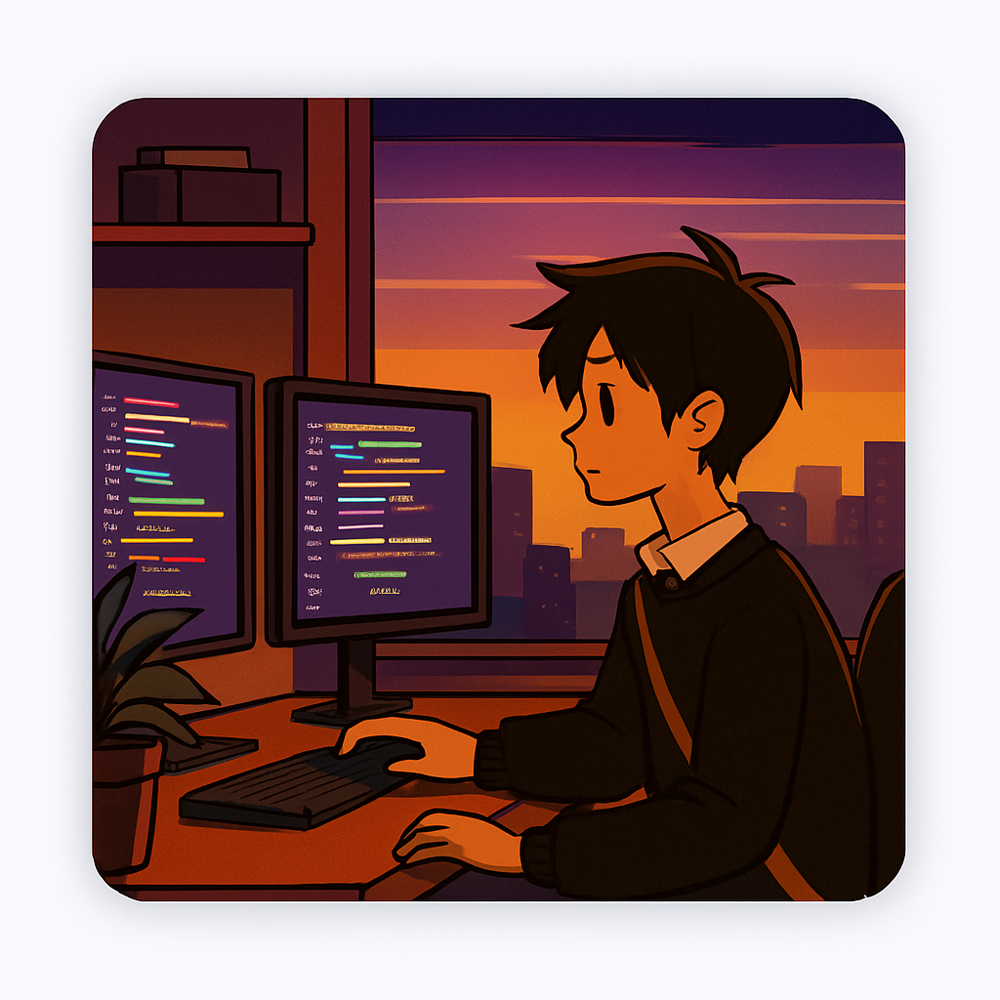
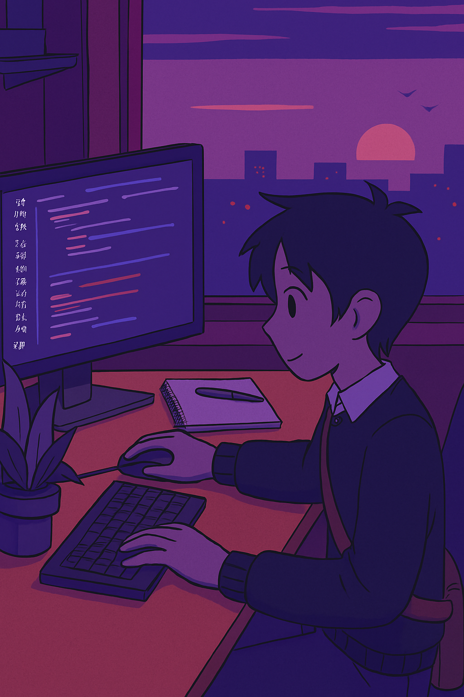

<!DOCTYPE html>
<html lang="es">
<head>
  <meta charset="UTF-8">
  <meta name="viewport" content="width=device-width, initial-scale=1.0">
  <title>Portafolio de Sthivens</title>
  <link rel="stylesheet" href="style.css">
</head>
<body>

  <header class="barra-superior">
    <nav class="navegacion">
      <ul>
        <li><a href="#inicio" class="activo">Inicio</a></li>
        <li><a href="#acerca">Acerca</a></li>
        <li><a href="#proyectos">Proyectos</a></li>
        <li><a href="#servicios">Servicios</a></li>
      </ul>
    </nav>
  </header>

<!-- 
-----------------------------------------------------------------------------------------------------------------------------------
                                                Contenedor de Hero Section
-----------------------------------------------------------------------------------------------------------------------------------
-->

  <section id="inicio">
    

      <h1>Hola, soy Sthivens</h1>
      <h2><mark>Ingeniero de Sistemas</mark></h2>
      <ul class="lista-info">
        <li>Actualmente estoy trabajando en mejorar mis habilidades de IA, Base de Datos y Python.</li>
        <li>Quiero especializarme en inteligencia de datos.</li>
        <li><a href="https://sthivens131.github.io/" target="_blank">Página web</a> Personal.</li>
        <li>Aprendiendo Inglés (A1).</li>
        <li>Actualmente estoy abierto para una nueva oportunidad laboral.</li>
        <li>Contáctame por mis Redes Sociales.</li>
        <li>Dato Curioso: Me estoy pasando Hollow Knight.</li>
      </ul>
      

        <a href="CV-Sthivens.pdf" class="btn negro">Descargar CV</a>
      

    

    

      
    

  </section>

<!-- 
-----------------------------------------------------------------------------------------------------------------------------------
                                                Contenedor de Acerca de mi Section
-----------------------------------------------------------------------------------------------------------------------------------
-->

  <section id="acerca">
    

      

        
      

      

        <h2 class="textoAcerca" id="animation1"><mark>Acerca de mí</mark></h2>
        

        Estudiante de Ingeniería en Sistemas, 
        actualmente cursando el sexto semestre en la 
        Universidad de los Andes – Núcleo Rafael Rangel. 
        

      

    

  </section>
    

  </section>

  -->
</body>
</html>
